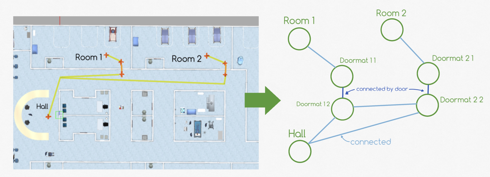
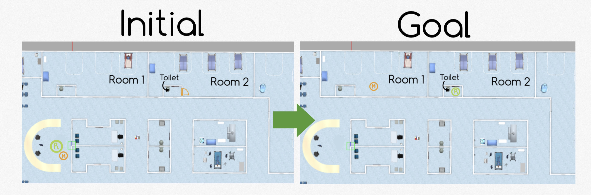
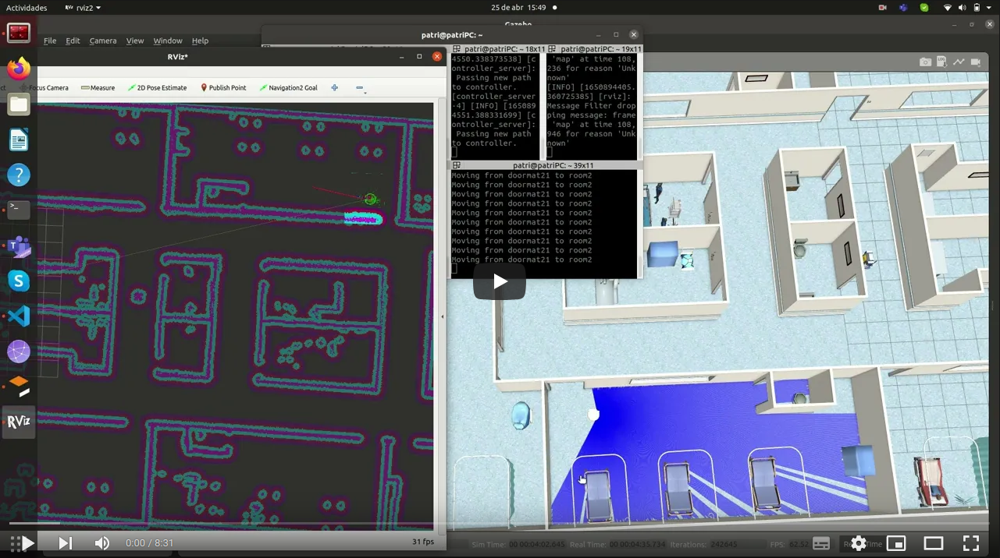

# PDDL Hospital implementation

## How have we described the movements in the world? 

Inspired by a topological map (nodes and connections between them). We consider instances of type room (stays) and some connections between them.

There are 2 types of connections:
- Point to point connections
- Door connections

This is so that two different actions can be used, one to move, for example, from the Hall to the outer "doormat" of ROOM1 and an action to go through the door to reach the inner "doormat" of that room.

This model has given us a lot of flexibility when designing scenaries and efficient routes between nodes. 

## Objects in the world
We can create instances of type "stuff". These will be objects in the world that can interact with via pick-and-drop primitives. Being able to move objects around the world.

## Relation between localitation and position
In PDDL we have names of locations. In order to become this real we have to deal with positions in the world. A correspondence between names and positions is needed.
For every reachable location defined in PDDL we have to define a position in real life. All positions can be found in "config/waypoints.yaml"

## Let's solve a problem
Problem description:

Considering the toilet in room2 with a door and room1 and room2 without one.
The medicines must be in room1 and the robot in the toilet of the room2. Both start at the hall. This may be a real problem.

## Video demostration

#### Mantainers
<p.colmenar.2019@alumnos.urjc.es>\
<v.perezb.2019@alumnos.urjc.es>
